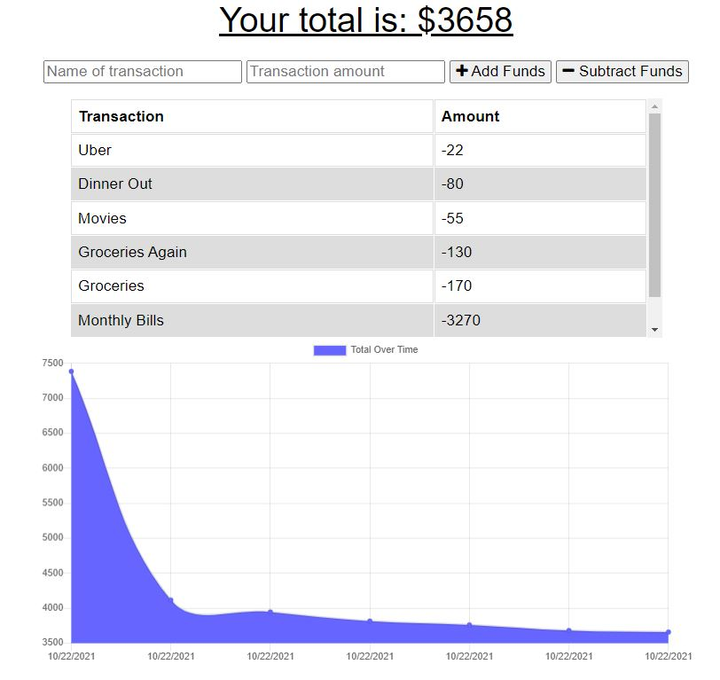

# budget_tracker by Nelson Carlos Da Silva

This repository contains my submission for the Progressive Web Applications Challenge: Budget Tracker. The challenge consists of updating an existing budget tracker application to allow for offline access and functionality. Requirements included using IndexedDB to add offline functionality, adding a service worker to the application, and addig a web manifest to the application.

If you are seeking the commits and coresponding messages from my work on this challenge, those can be found at my repository, here:

https://github.com/nelsondcds/budget_tracker

The link to the deployed application can be found here:

[Budget Tracker](https://rocky-refuge-98533.herokuapp.com/)

A screenshot of my submission can be found here:

